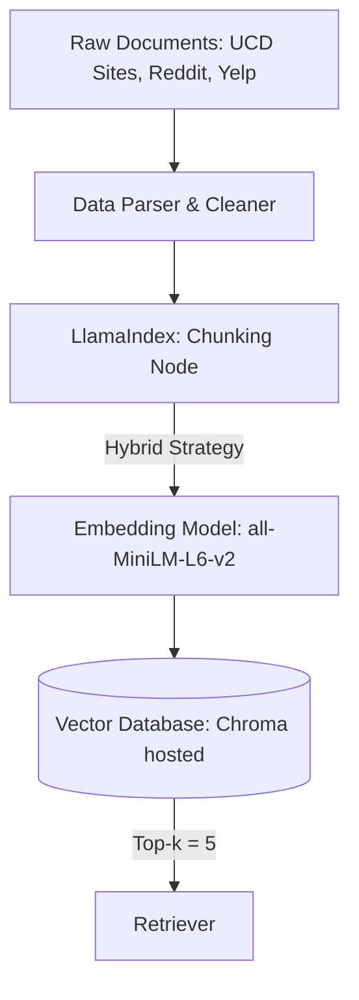

# Project 1 Planning: The Unofficial Guide

> Write this document before you write any pipeline code.
> Your spec and architecture diagram are what you'll use to direct AI tools (Claude, Copilot, etc.) to generate your implementation — the more specific they are, the more useful the generated code will be.
> Update the Retrieval Approach and Chunking Strategy sections if you change your approach during implementation.
> Update this file before starting any stretch features.

---

## Domain

For my system, I want my domain to be "Food at UC Davis." Throughout my time at UC Davis, I found it hard to find places that were affordable and satisying as freshman. We were given $200 in AggieCash and I spent so much of it on this 1 food truck because I didn't know which other popular food spots existed. This knowledge is valuable because everyone has to eat and the dining commons often don't satisfy the needs of all students at UC Davis. This tool would be incredibly useful in answering student questions and help them find exactly the meal they are looking for. 

---

## Documents

<!-- List your specific sources: URLs, subreddit names, forum threads, or file descriptions.
     Aim for at least 10 sources that together cover different subtopics or perspectives within your domain. -->

| # | Source | Type | URL or file path |
|---|--------|------|-----------------|
| 1 | UCD Dining Website | URL | [Segundo Dining Commons](https://housing.ucdavis.edu/dining/dining-commons/segundo/) |
| 2 | UCD Dining Website | URL | [Gunrock](https://housing.ucdavis.edu/dining/the-gunrock/) |
| 3 | UCD Dining Website | URL | [Food Trucks](https://housing.ucdavis.edu/dining/food-trucks/) |
| 4 | UCD Dining Website | URL | [Sage Street](https://housing.ucdavis.edu/dining/sage-street/) |
| 5 | UCD Dining Website | URL | [Latitude Market](https://housing.ucdavis.edu/dining/latitude-market/) |
| 6 | UCD Dining Website | URL | [Latitude](https://housing.ucdavis.edu/dining/latitude/) |
| 7 | Reddit | URL | [Restaurants to Try before You Graduate](https://www.reddit.com/r/UCDavis/comments/1j2xry7/must_try_davis_restaurants_before_you_graduate/) |
| 8 | Yelp | URL | [Nice Restaurants in Davis](https://www.yelp.com/search?find_desc=Nice+Restaurant&find_loc=Davis%2C+CA) |
| 9 | Tripadvisor | URL | [Best Places in Davis](https://www.tripadvisor.com/Restaurants-g32283-Davis_California.html) |
| 10 | Quora | URL | [Best Bite in Davis](https://www.quora.com/What-are-the-best-restaurants-near-UC-Daviss-campus) |

---

## Chunking Strategy
**Chunk size:** 
I will use a Hybrid Chunking Strategy depending on the source type, with an average target size of 500–800 characters (~125–200 tokens) for unstructured reviews, and Markdown Element-Based Chunking for official UC Davis web pages.

**Overlap:**
For unstructured data (Reddit, Yelp, Quora, Tripadvisor), I will use a 100-character (~25 tokens) sliding window overlap. For official UCD Dining pages chunked by Markdown headers, I will use 0 character overlap, but explicitly inject the global page context (e.g., Restaurant: Segundo Dining Commons) into the metadata of every sub-chunk.

**Reasoning:**
My dataset contains two distinct document archetypes that require different handling to prevent context fragmentation:
- Official UCD Dining Pages (Structured): These pages contain dense, tabular, or highly categorized information (e.g., operational hours, explicit menu items, AggieCash acceptance). Fixed-token chunking would inevitably split a restaurant’s name from its operational hours or accepted payment methods. Chunking strictly by Markdown elements (headers like ### Hours or ### Menu) guarantees that critical business facts stay bundled together as a single semantic unit.
- Social Media/Review Platforms (Unstructured): Reddit threads and Yelp reviews are highly conversational. A single Reddit comment might list five different favorite spots in Davis in a single paragraph. A 500–800 character size is tight enough to isolate individual restaurant recommendations without mashing distinct spots together, while the 100-character overlap ensures that transitions or multi-sentence descriptions of a specific dish (like a review highlighting a specific spicy wing flavor or garlic knot spot) aren't cut in half.
- Metadata Injection (Context Preservation): Because forum comments often use pronouns (e.g., "The food truck outside Silo has the best sliders, I spent all my AggieCash there"), I will preprocess unstructured files by appending the thread title or platform metadata directly into the text body of each chunk. This ensures the vector embeddings capture the spatial and institutional context of Davis.

---

## Retrieval Approach

<!-- Which embedding model are you using (e.g., all-MiniLM-L6-v2 via sentence-transformers)?
     How many chunks will you retrieve per query (top-k)?
     If you were deploying this for real users and cost wasn't a constraint, what tradeoffs
     would you weigh in choosing a different embedding model — context length, multilingual
     support, accuracy on domain-specific text, latency? -->

**Embedding model:**
It creates 384-dimensional vectors, which is lightweight and perfect for running locally during development without API costs.

**Top-k:** 
5

**Production tradeoff reflection:**
If deploying this to a broader student base and cost wasn't an issue, I would upgrade to OpenAI's text-embedding-3-small. While all-MiniLM-L6-v2 is fast and free, it struggles slightly with highly specific domain jargon or slang. A commercial model has a longer context window and better multilingual support (useful if international students are searching for specific hometown cuisines). However, it introduces latency and API costs, which requires balancing against the performance of our backend systems.

---

## Evaluation Plan

<!-- List your 5 test questions with their expected correct answers.
     Questions should be specific enough that you can judge whether the system's response
     is right or wrong. "What are good dining halls?" is too vague.
     "What do students say about wait times at [dining hall name] during lunch?" is testable. -->

| # | Question | Expected answer |
| 1 | What are the hours for Segundo Dining Commons on a Tuesday? | 7:00 AM – 10:00 PM |
| 2 | Does The Gunrock accept meal swipes or AggieCash? | "No, The Gunrock does not accept meal swipes or recharge billing." |
| 3 | Where can I get good garlic knots and a spinach stromboli near campus? | [Should retrieve Yelp/Reddit chunks pointing to local Italian restaurants or pizza spots in downtown Davis] |
| 4 | Which spots in Davis have the best spicy mango habanero wings? | [Should retrieve Quora/Reddit chunks mentioning Wingstop or local wing joints] |
| 5 | Are there any places near the dorms that serve Indian street food like pav bhaji? | [Should retrieve Latitude Dining information regarding their Indian platform or Reddit chunks mentioning local international food markets]

---

## Anticipated Challenges

<!-- What could go wrong? Name at least two specific risks with reasoning.
     Consider: noisy or inconsistent documents, missing source attribution, off-topic
     retrieval, chunks that split key information across boundaries. -->

1. **Entity Resolution and Slang:** Students rarely use official names. A query for "the DC" or "CoHo" might fail to retrieve chunks from the official housing sites that strictly use "Segundo Dining Commons" or "ASUCD Coffee House." The embedding model might not naturally bridge that semantic gap without manual synonym injection.

2. **Conflicting Temporal Data:** Official UCD hours might say a food truck closes at 8:00 PM, but a Reddit post might complain that "they always pack up and leave by 7:30 PM." The LLM could hallucinate or prioritize the conversational review over the official structured schedule, giving the user incorrect operational hours.

---

## Architecture

<!-- Draw a diagram of your pipeline showing the five stages:
     Document Ingestion → Chunking → Embedding + Vector Store → Retrieval → Generation
     Label each stage with the tool or library you're using.
     You can use ASCII art, a Mermaid diagram, or embed a sketch as an image.
     You'll use this diagram as context when prompting AI tools to implement each stage. -->

---

'''mermaid
     graph TD;
          A[Raw Documents: UCD Sites, Reddit, Yelp] --> B[Data Parser & Cleaner];
          B --> C[LlamaIndex: Chunking Node];
    
    subgraph Backend Infrastructure;
    C -->|Hybrid Strategy| D[Embedding Model: all-MiniLM-L6-v2];
    D --> E[(Vector Database: Chroma hosted)];
    E -->|Top-k = 5| F[Retriever];
    end

    G[Student Query] --> D
    G --> F
    F --> H[LLM Synthesis: Prompt Template]
    H --> I[Final Answer to User]
'''

## AI Tool Plan

<!-- For each part of the pipeline below, describe:
     - Which AI tool you plan to use (Claude, Copilot, ChatGPT, etc.)
     - What you'll give it as input (which sections of this planning.md, which requirements)
     - What you expect it to produce
     - How you'll verify the output matches your spec

     "I'll use AI to help me code" is not a plan.
     "I'll give Claude my Chunking Strategy section and ask it to implement chunk_text()
     with my specified chunk size and overlap" is a plan. -->

**Milestone 3 — Ingestion and chunking:**

**Milestone 4 — Embedding and retrieval:**

**Milestone 5 — Generation and interface:**
